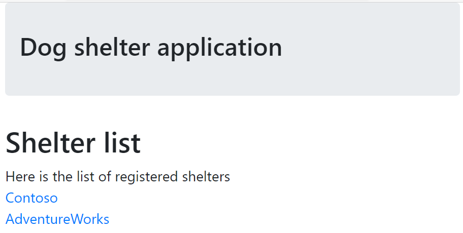
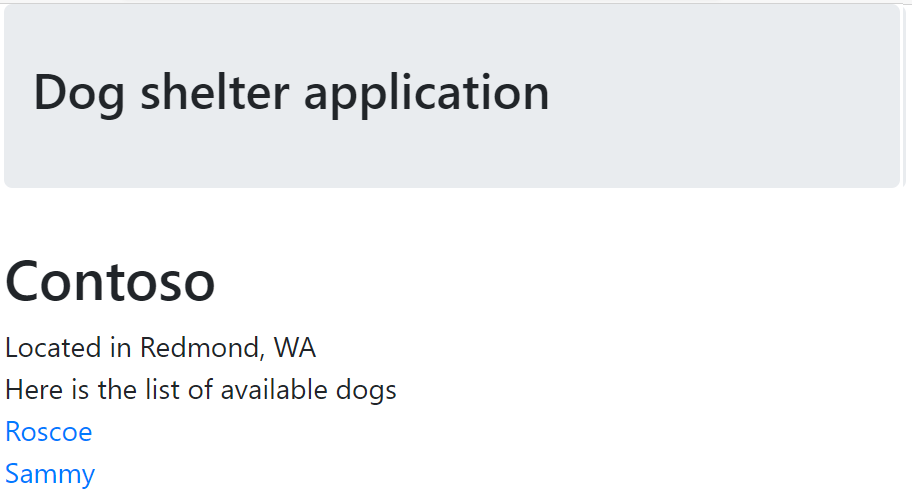

Let's create two templates to display a list of shelters, and a detail page for each shelter. We will also create a base template to ensure consistency across our application.

## Create the base template

A base template is common for all Django projects. We will start by creating our base template.

1. Inside Visual Studio Code, create a new folder inside **dog_shelters** named **templates**
1. Create a new file inside **templates** named **base.html**
1. Add the following HTML to **base.html**

    ```html
    <!DOCTYPE html>
    <html lang="en">
    <head>
        <meta charset="UTF-8">
        <meta http-equiv="X-UA-Compatible" content="IE=edge">
        <meta name="viewport" content="width=device-width, initial-scale=1.0">
        <title>Dog shelter site</title>
        <link rel="stylesheet" href="https://cdn.jsdelivr.net/npm/bootstrap@4.6.0/dist/css/bootstrap.min.css" integrity="sha384-B0vP5xmATw1+K9KRQjQERJvTumQW0nPEzvF6L/Z6nronJ3oUOFUFpCjEUQouq2+l" crossorigin="anonymous">
    </head>
    <body>
        <article class="container">
            <section class="jumbotron">
                <h3>Dog shelter application</h3>
            </section>
            
                
        </article>
    </body>
    </html>
    ```

    > ![NOTE]
    > We are using [Bootstrap version 4.6](https://getbootstrap.com/docs/4.6/getting-started/introduction/) for our site. No Bootstrap knowledge will be required, however. We are only using one class ([jumbotron](https://getbootstrap.com/docs/4.6/components/jumbotron/)), but otherwise we will be using core HTML.

Notice the two `` statements, one for the `title` and the next for the `content` the child pages will provide. We are providing a default value for `title`, which ensures we will always have a title if a child page doesn't set it.

## Create the shelter list template

We will now create another template for listing all shelters. We will loop through the list of shelters, and create links to details for all shelters.

1. Inside **dog_shelters/templates**, create a new file named **shelter_list.html**
1. Add the following to create the template for our shelter list:

    ```html
    

    
    Shelter list
    

    
    <h2>Shelter list</h2>
    <div>Here is the list of registered shelters</div>
        
            <div>
                <a href="">
                    {{shelter.name}}
                </a>
            </div>
        
    </div>
    
    ```

We use the `block` tags to indicate where we want our information to be placed. We specify a `title` of **Shelter list**, and the `content` will be the list of all shelters.

We are also using a new tag, `url`. The `url` tag generates a URL dynamically. Our URLs are registered in our URLconf. As a result, they could potentially change. By using the `url` tag, we can tell Django to retrieve the appropriate URL from the URLconf rather than hard-coding in a path. `url` looks for the name of the path, **shelter_detail** in our case, and then the list of any parameters expected. **shelter_detail** has one parameter `pk`, which will be the primary key, or id, of the shelter. We specify the id by using `shelter.id`.

## Create the shelter detail template

With our list template created, we can now create the detail template.

1. Create a new file inside **dog_shelters/templates** called **shelter_detail.html**
1. Add the following to create the template:

    ```html
    

    
    Shelter list
    

    
    <h2>{{ shelter.name }}</h2>
    <div>Located in {{ shelter.location }}</div>
    
        <div>Here is the list of available dogs</div>
        
            <div>
                <a href="">
                    {{dog.name}}
                </a>
            </div>
        
        </div>
    
        <div>This shelter has no dogs available for adoption</div>
    
    
    ```

Notice in the body we check to see if any dogs are inside the shelter by using `if shelter.dog_set.all`. If there are dogs, we display the list by using `for` to loop through all the dogs. Otherwise we display a message saying no dogs are available. We will update the link in a later unit.

> ![NOTE]
> You may notice we are making two calls to `shelter.dog_set.all`. If you are experienced with databases and ORMs, you might be concerned we are making two calls to the database, which would be a performance hit. Django has built-in caching, which will ensure only one call to the database is made.

## Test the site

With our templates created, we can see our site in action!

1. Save all files
1. Open your browser and navigate to **http://localhost:8000**
1. The list of shelters should now display

    

1. Click on **Contoso**
1. The list of dogs for Contoso now displays

    
