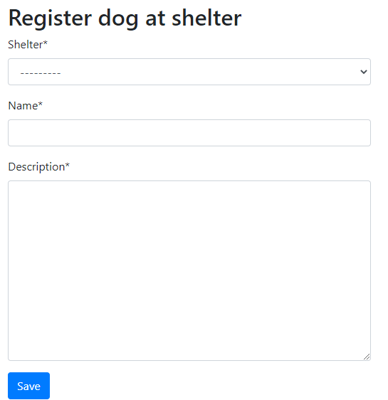

After viewing the created form you may have noticed the formatting wasn't the same as the rest of our page. We are using [Bootstrap](https://getbootstrap.com/docs/4.6/getting-started/introduction/), and the form currently isn't. Fortunately, there is a library which can ensure our forms use Bootstrap as well.

## django-crispy-forms

[django-crispy-forms](https://django-crispy-forms.readthedocs.io/en/latest/) is a library to further enhance how forms are generated by Django. We are going to explore how we can use the library to ensure our forms use Bootstrap.

## Install the library

As with any Python library, we install **django-crispy-forms** by using [pip](https://pypi.org/project/pip/).

1. Inside Visual Studio Code, open **requirements.txt**
1. At the bottom of the file, add a **new line** which reads:

    ```text
    django-crispy-forms
    ```

1. Open a new terminal window by clicking **Terminal** > **New Terminal**
1. Install all packages by executing the following command:

    ```bash
    pip install -r requirements.txt
    ```

## Register the app in Django and configure the template

Anything Django uses must be registered as an app or middleware. django-crispy-forms is an app, so we will list it in the `INSTALLED_APPS` list.

1. Inside Visual Studio Code, open **project/settings.py**
1. Below the line which reads `# TODO: Register crispy_forms`, add the following to register django-crispy-forms:

    ```python
    # TODO: Register crispy_forms
    'crispy_forms',
    ```

1. Below the line which reads `# TODO: Set template_pack`, add the following code to configure django-crispy-forms to use Bootstrap 4:

    ```python
    # TODO: Set template_pack
    CRISPY_TEMPLATE_PACK = 'bootstrap4'
    ```

## Update our template to use django-crispy-forms

django-crispy-forms does the bulk of it's amazing work through the use of a filter. A filter allows you to take a variable in a template and pass it into another handler or process. In our case, the `crispy` filter will convert our form to the specified template - Bootstrap 4.

1. Inside Visual Studio Code, open **dog_shelters/templates/dog_form.html**
1. Below the line which reads `{# TODO: Load crispy_forms_tags #}`, add the following to load the filter or tag:

    ```html
    {# TODO: Load crispy_forms_tags #}
    
    ```

1. **REPLACE** the line which reads `{{ form.as_p }}` with the following to use the `crispy` filter:

    ```html
    {{ form | crispy }}
    ```

## Test the site

With everything installed and updated, let's test our site!

1. Save all files by clicking **File** > **Save All**
1. In your browser, navigate to **http://localhost:8000/dog/register**
1. You will see the page is now using Bootstrap for the form

    

You have now updated your application so the form uses Bootstrap.
