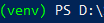

[1]: https://docs.djangoproject.com/en/3.1/topics/install/ "Django Installation Guide"
[2]: https://www.python.org/  "Install Python"
[3]: https://www.djangoproject.com/ "Django Website"
[4]: https://www.djangoproject.com/start/ "Get Started with Django"
[5]: https://docs.djangoproject.com/en/3.1/intro/install/ "Django Quick Install Guide"
[6]: https://docs.djangoproject.com/en/3.1/faq/install/#faq-python-version-support "Django Python Version"

While the Django framework may have a little bit of a learning curve, they have provided everything you need to get started on their [website][3]. When browsing you will see the choice to either go through the [tutorials and documentation][4], or just downloading the framework with their [quick install guide][5].

## Installation overview

Before installing Django we first need to make sure the correct Python version is installed for the framework. In order to check your installed version navigate to your command prompt and type the following.

```bash
# Windows or Linux
python --version 

# macOS
python -V 
```
By executing this command it will display what Python version is installed on your computer. For this module we are using the latest official version of Django and they recommend using Python 3 in order to have access to the latest Python features. If you do not have Python installed then proceed to the [Python website][2] to download the correct version.

## Creating a virtual environment

Before downloading Django it is a good idea to create a virtual environment in order to isolate it from other applications. If a virtual environment is not created and the framework is installed globally it could cause a conflict with other Python applications causing them to fail. 

Start by creating a folder that will contain the new project as this will also hold the folder for the virtual environment. In order to create the folder go to the command prompt, navigate to the desired directory and run the below command. For this example we will be creating a folder called **mydjangoproject**. 

```python
# Windows
md mydjangoproject
# Command to change directory
cd mydjangoproject

# macOS or Linux
mkdir mydjangoproject
# Command to change directory
cd mydjangoproject
```
After the folder is created then change the directory and enter the below code in the command line.

```bash
# Windows
py -3 -m venv venv

# macOS or Linux
python3 -m venv venv
```
After executing the command there should now be a new virtual environment named **venv** contained within the directory. 

## Activating a virtual environment

Now that the virtual environment has been created we have to activate it before installing Django. Using the command prompt go to the directory where the virtual environment folder is located and type the below command.

```bash
venv\Scripts\activate
```
By executing this command the virtual environment will start, and the command prompt should now look similar to below.



The name of the virtual environment will be in parentheses followed by the path that you are in currently. This command prompt is where you will begin installing the Django framework.

## Django installation

Now that the virtual environment has been activated it is time to download Django. Using the same command line type the below command.

```bash
pip install Django
```
With this command the Django framework will begin to download, and once completed we can start developing our app!