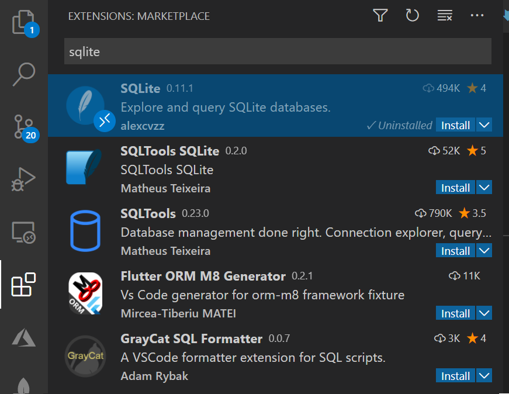
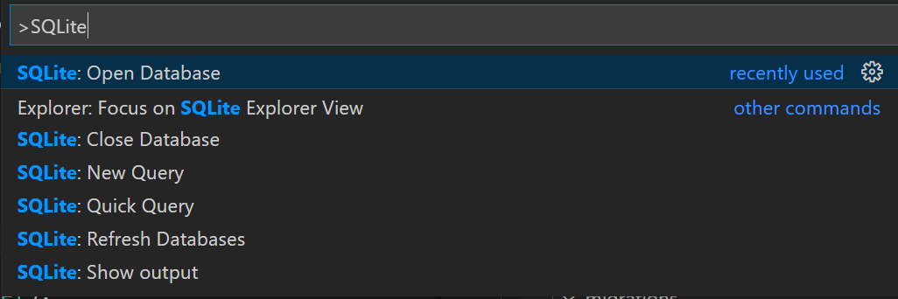

With our models created, let's create our database. We will use the default of SQLite, and the different tools available through Django.

## List all migrations

Let's start by listing all migrations.

1. Inside the **terminal** window **Visual Studio Code**, execute the following command:

```bash
python manage.py showmigrations
```

You will notice there's a list of migrations! You might wonder why you have migrations since you just started your application and haven't made any. Django includes various tables for its user management system, managing sessions, and other internal uses.

## Create migrations for dog_shelters

Let's tell Django that new models are added and we would like for the changes to be stored as a migration.

1. Return to the **terminal** window inside **Visual Studio Code**
1. Execute the following

    ```bash
    python manage.py makemigrations dog_shelters
    ```

After running the command you should see something similar to below stating it has stored both models as a migration.


## Update the database

The **migrate** command will execute all migrations, and in the case of SQLite even create the database if it doesn't exist. Let's create our database and perform the migrations.

1. Return to the **terminal** window inside **Visual Studio Code**
1. Execute the following

    ```bash
    python manage.py migrate
    ```

All migrations will be executed, which includes the one we created and the ones built-in to Django.

## Displaying the schema

Now that we completed the necessary setup for our SQLite database, let's use the [SQLite](https://marketplace.visualstudio.com/items?itemName=alexcvzz.vscode-sqlite) Visual Studio Code extension to explore the created schema.

1. Click the **Extensions** button on the workbench, and search for **SQLite**

    

1. Click **Install** on **SQLite**

    > [!NOTE] 
    > You may receive an error message about not being able to access the SQLite core process. If this happens, you can [install SQLite](https://www.sqlite.org/download.html) for your operating system.

1. Open the command pallet by hitting **Ctl-Shift-P** (or **Cmd-Shift-P** on a Mac)
1. Type **SQLite** and choose **SQLite: Open Database**

    

1. Choose **db.sqlite3**
1. At the bottom of your workbench on the left side, click the arrow next to **SQLITE EXPLORER**

    

1. You can now see the list of all the created tables. If you expand each one you will see the various columns. If you explore your **shelter** and **dog** tables you will notice the various columns you created, including the **id** column which is automatically created on each table.

## Summary

You have now managed a database using Django, deploying any changes you have made.
