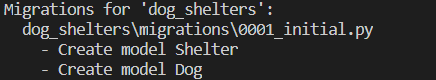
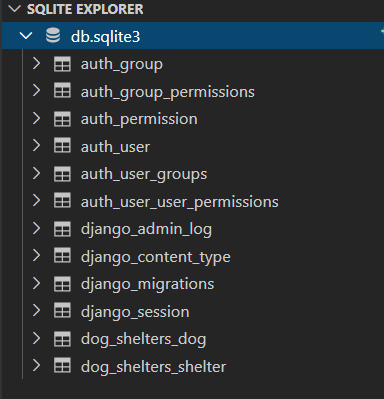

Now that we have activated our database it is time to start creating our models. By creating a model we are able to update the database by adding any essential fields and defining the behavior of our data. We will continue building our **dog_shelters** application.

## Creating Models

The first step in our process is to add the models. Django provides an empty file named **models.py** which you can use for your models.

1. Open the **dog_shelters/models.py** file inside Visual Studio Code

2. Add two Python classes to contain our models by entering the below code under the comment `#[TODO] Create the app models`.

```python
#[TODO] Create the app models.
import datetime

class Shelter(models.Model):
    shelter_name = models.CharField(max_length=200)
    shelter_location = models.CharField(max_length=200)

class Dog(models.Model):
    shelter = models.ForeignKey(Shelter, on_delete=models.CASCADE)
    dog_name = models.CharField(max_length=200)
    dog_description = models.CharField(max_length=200)
    dog_image = models.ImageField(upload_to='images', blank=True)
    drop_off_date = models.DateTimeField(default=datetime.datetime.now())
    adoption_date = models.DateTimeField(default=datetime.datetime.now(), blank=True, null=True)
    dog_breed = models.CharField(max_length=200)
```

By adding these models you are generating a field in the database and defining how that field should behave. For instance, in `adoption_date` we have created a field for date and time. For this to work correctly we needed to import `datetime`, and by adding `now()` to the field behavior it will now automatically populate with the current date and time. This field type is also automatically set as required so we had to let Django know it could be blank by setting `blank=True` and the database entry as null by setting `null=True`. 

Also take notice of the term `ForeignKey` that was added in the `Dog` class. This keyword tells Django there is a relationship between a `Dog` and the `Shelter`. By defining this relationship we are telling Django that every **dog** is related to a single **shelter**.

## Working with images

For this app it would also be a good idea to add an image of the dog up for adoption. In order to allow an upload of an image we added the `ImageField` within the `Dog` class when we previously created the app models.

```python
dog_image = models.ImageField(upload_to='images', blank=True)
```

As you can see in the above code line we needed to state where the image would be saved by using the `upload_to='images'` statement, and that it was ok for the field to be blank by adding `blank=True`. Since we added this field we also have to add a statement in the **urls.py** file in the **adoptadog** project folder. 

1. Add the code under the comments `# [TODO]: Add the needed imports for the image field` and `# [TODO]: Add the needed urlpattern for the image upload`.

```python
# [TODO]: Add the needed imports for the image field
from django.conf import settings
from django.conf.urls.static import static

urlpatterns = [
    path('admin/', admin.site.urls),
    # [TODO]: Add the needed urlpattern for the image upload
] + static(settings.MEDIA_URL, document_root=settings.MEDIA_ROOT)
```

By importing `settings` and `static` and also adding the above `static` line, the project will now be able to recognize the image link and upload it to our site when requested.

## Activating the model

All applications must be registered with the project in Django. It may seem a little counter-intuitive, but just because an application folder exists inside a project doesn't mean it automatically gets loaded. We need to activate it by adding it to the list of `INSTALLED_APPS`.

1. Find the configuration class name within the **dog_shelters** app. To find this class name go to the **dog_shelters/apps.py** file to find the below code and to see that the class name is `DogSheltersConfig`.

```python
class DogSheltersConfig(AppConfig):
    name = 'dog_shelters'
```

2. Now that you have the class name, return to the inner **adoptadog** folder and **settings.py** file to add the app config line under the comment `#[TODO] - Add the app to the list of INSTALLED_APPS`.

```python
INSTALLED_APPS = [
    #[TODO] - Add the app to the list of INSTALLED_APPS
    'dog_shelters.apps.DogSheltersConfig',
    'django.contrib.admin',
    'django.contrib.auth',
    'django.contrib.contenttypes',
    'django.contrib.sessions',
    'django.contrib.messages',
    'django.contrib.staticfiles',
]
```

By adding this line to the list of `INSTALLED_APPS` it tells Django that this app needs to be included when running the project.

## Updating the database

Next, we need to tell Django that new models are added and we would like for the changes to be stored as a migration.

1. Return to the terminal window inside Visual Studio Code

2. Execute the following

```python
python manage.py makemigrations dog_shelters
```

After running the command you should see something similar to below stating it has stored both models as a migration.



Now in order to make our changes permanent to the database the final step is to run the migrate command in the command line.

```python
python manage.py migrate
```

This command will apply all of our migrations and once complete you should be able to see the new additions in the schema of the database. 




[!NOTE] If you don't remember how to display the schema refer to the previous unit **Displaying The Schema**.
