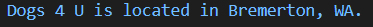

## Creating a model

Now that we have activated our database it is time to start creating our models. By creating a model we are able to update the database by adding any essential fields and defining the behavior of our data. In this exercise we will be using our **dog_shelters** app that was downloaded from GitHub.

The first step in our process is to add the models. This can be achieved by going to the **dog_shelters/models.py** file and adding two Python classes to contain our models. Enter the below code under the comment `#[TODO] Create the app models`.

```python
#[TODO] Create the app models.
import datetime

class Shelter(models.Model):
    shelter_name = models.CharField(max_length=200)
    shelter_location = models.CharField(max_length=200)

class Dog(models.Model):
    shelter = models.ForeignKey(Shelter, on_delete=models.CASCADE)
    dog_name = models.CharField(max_length=200)
    dog_description = models.CharField(max_length=200)
    dog_image = models.ImageField(upload_to='images', blank=True)
    drop_off_date = models.DateTimeField(default=datetime.datetime.now())
    adoption_date = models.DateTimeField(default=datetime.datetime.now(), blank=True, null=True)
    dog_breed = models.CharField(max_length=200)
```

By adding these models you are generating a field in the database and defining how that field should behave. For instance, in **adoption_date** we have created a field for date and time. For this to work correctly we needed to import **datetime**, and by adding **now()** to the field behavior it will now automatically populate with the current date and time. This field type is also automatically set as required so we had to let Django know it could be blank by setting **blank=True** and the database entry as null by setting **null=True**. 

Also take notice of the term **ForeignKey** that was added in the **Dog** class. This keyword tells Django there is a relationship between a **Dog** and the **Shelter**. By defining this relationship we are telling Django that every **dog** is related to a single **shelter**.

For this app it would also be a good idea to add an image of the dog up for adoption. In order to allow an upload of an image we created the **ImageField**.

```python
dog_image = models.ImageField(upload_to='images', blank=True)
```
For this field we needed to state where the image would be saved by using the `upload_to='images'` statement, and that it was ok for the field to be blank by adding `blank=True`. Since we added this field we also have to add a statement in the ***urls.py** file in the **mydjangoproject** project folder. Add the code under the comments `# [TODO]: Add the needed imports for the image field` and `# [TODO]: Add the needed urlpattern for the image upload`.

```python
# [TODO]: Add the needed imports for the image field
from django.conf import settings
from django.conf.urls.static import static

urlpatterns = [
    path('admin/', admin.site.urls),
    # [TODO]: Add the needed urlpattern for the image upload
] + static(settings.MEDIA_URL, document_root=settings.MEDIA_ROOT)
```
By importing **settings** and **static**, and also adding the above **static** line the project will now be able to recognize the image link and upload it to our site when requested.

## The \_\_str__ method

Now that we have created the **Shelter** and **Dog** models for our app there is one important addition that needs to be addressed when defining classes.
For this example we start by creating another class named **Shelter**. This example will not be added to our app, but can be tested out in the Python shell.

```python
class Shelter:
    def __init__(self, shelter_name, shelter_location):
        self.shelter_name = shelter_name
        self.shelter_location = shelter_location
```  

After creating the class, we now create an instance by entering a shelter name and their location.

```python
my_shelter = Shelter('Dogs 4 U', 'Bremerton, WA')
```

Now print the information to the console to see what appears.

```python
print(my_shelter)
```

 

When looking at the output of the **my_shelter** variable it doesn't give us any details. While it does give the class name, it only returns the id or memory address of the object. To solve this issue we need to add the \_\_str__ method to our class.

Now let's take the same code, but add the \_\_str__ method as below.

```python
class Shelter:
    def __init__(self, shelter_name, shelter_location):
        self.shelter_name = shelter_name
        self.shelter_location = shelter_location

    def __str__(self):
        return f'{self.shelter_name} is located in {self.shelter_location}.'
```

Since we have now defined the \_\_str__ method let's again create an instance with the below line of code.

```python
my_shelter = Shelter('Dogs 4 U', 'Bremerton, WA')
```

Now print again to the console.

```python
print(my_shelter)
```



As you can see this now returns the shelter name and location but with some additional details. By adding these details it makes the information easier to understand then just printing out the name and location. With that said, lets now make our models more informative by adding a \_\_str__ method. Enter the code under the comments `# [TODO] Add __str__ method to Shelter model` and `# [TODO] Add __str__ method to Dog model`.

```python
class Shelter(models.Model):
    shelter_name = models.CharField(max_length=200)
    shelter_location = models.CharField(max_length=200)
    # [TODO] Add __str__ method to Shelter model
    def __str__(self):
        return self.shelter_name
        return self.shelter_location

class Dog(models.Model):
    shelter = models.ForeignKey(Shelter, on_delete=models.CASCADE)
    dog_name = models.CharField(max_length=200)
    dog_description = models.CharField(max_length=200)
    dog_image = models.ImageField(upload_to='images', blank=True)
    drop_off_date = models.DateTimeField(default=datetime.datetime.now())
    adoption_date = models.DateTimeField(default=datetime.datetime.now(), blank=True, null=True)
    dog_breed = models.CharField(max_length=200)

    # [TODO] Add __str__ method to Dog model
    def __str__(self):
        return self.dog_name
        return self.dog_description
        return self.drop_off_date
        return self.adoption_date
        return self.dog_breed
```

With this addition to our **Shelter** and **Dog** classes it will now print out the shelter name and location along with the information about the dogs.

## Activating the model

Now that we have added the model code to our file it is time for activation.

First, we need to find the configuration class name within the **dog_shelters** app. To find this class name go to the **dog_shelters/apps**.**py** file to find the below code and to see that the class name is `DogSheltersConfig`.

```python
class DogSheltersConfig(AppConfig):
    name = 'dog_shelters'
```

Now that you have the class name, return to the inner **mydjangoproject** folder and **settings**.**py** file to add the app config line under the comment `#[TODO] - Add the app to the list of INSTALLED_APPS`.

```python
INSTALLED_APPS = [
    #[TODO] - Add the app to the list of INSTALLED_APPS
    'dog_shelters.apps.DogSheltersConfig',
    'django.contrib.admin',
    'django.contrib.auth',
    'django.contrib.contenttypes',
    'django.contrib.sessions',
    'django.contrib.messages',
    'django.contrib.staticfiles',
]
```

By adding this line to the list of **INSTALLED_APPS** it tells Django that this app needs to be included when running the project.

Next, we need to tell Django that new models are added and we would like for the changes to be stored as a migration. In order to do this run the below code in the command line.

```python
python manage.py makemigrations dog_shelters
```

After running the command then you should see something similar to below stating it has stored both models as a migration.


Now in order to make our changes permanent to the database the final step is to run the migrate command in the command line.

```python
python manage.py migrate
```

This command will apply all of our migrations and once complete you should be able to see the new additions in the schema of the database. 


[!NOTE] If you don't remember how to display the schema refer to the previous unit **Displaying The Schema**.
