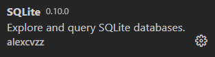

[1]: https://www.sqlite.org/download.html "Link to SQLite webpage"

When creating a database driven application you of course need a database. For development purposes, Django natively supports SQLite. We will explore how to create the initial database, and explore the schema.

## Creating the database

If you examine **settings.py** inside the **adoptadog** project, you will notice a variable called DATABASES with a property of `default`. This is the connection settings for the default database, which is SQLite out of the box.

Django has a structure defined for new projects which contains tables for core features of the framework. However, the database is not created automatically. We can create the database by using migrate, which takes all staged changes for the database and applies them. In the case of SQLite, if the database is not already created Django will automatically create it.

1. Inside **Visual Studio Code** open the inline terminal window by clicking **Terminal > New Terminal** (or hitting **Ctl + Shift+ `**)

2. Execute the following command inside the terminal window

```bash
python manage.py migrate
```

By running this command, Django searches for the **INSTALLED_APPS** setting within the **settings.py** file and creates any necessary tables according to the default settings.

## Displaying the schema

Now that we completed the necessary setup for our SQLite database, let's uncover the two ways to check out the schema. The first will be through the SQLite command line and the second will be in VSCode. 

[!NOTE] This task assumes SQLite is already installed, but if not then go to the SQLite website to download the [SQLite application][1].

1. The first way to check out the schema of the newly created database is to use the SQLite command line. For this task, browse through the file explorer and find the newly created database file and double click on the file.

    

    By clicking on the file it will open a new window. Once the new window is open and you are able to see the SQLite command line, enter `.schema` to display the schema of the database.

    

2. The second option to check out the contents of the database is to view it in VSCode. While there are different extensions available, we choose to install the **vscode-sqlite** extension.

    

    After installing this extension, hold down **CTRL + Shift + P** to view the command palette. Enter **SQLite: Open Database**, and then choose the appropriate database from the dropdown list. This will then open up a new view in the Explorer Pane where you can now view the database structure.

    


## Exploring the Schema

Now that we have opened the database on Visual Studio Code hover over **dog_shelters_dog** and you will see an arrow appear to the right of the name. By hovering over the arrow it should say **Show Table**. 

1. Now Click on the arrow and a new preview window will open with the table and the current data. While you are not able to edit any information within the table you can at least look at the data to perform any needed queries or download the table in different file formats.

 

[!NOTE] When clicking on the arrow to show the database table sometimes it will at first appear blank. Click on the arrow again and the data should then appear.
