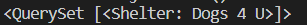

[2]: https://docs.djangoproject.com/en/3.1/topics/db/queries/ "Django Queries"

## Exploring the Django ORM
After we created the models for our app Django automatically created an API. This API allows us to easily create, retrieve, update and delete objects in our database. To begin this interaction we first have to call a python shell by entering the below command in the command line.

```bash
    python manage.py shell
```

Once the interactive console begins we then need to import the two models that were created for the **dog_shelters** app as below.

```python
from dog_shelters.models import Shelter, Dog 
```

Before moving on to create an object, let's first test a query by asking Django to pull all shelters that have been created. 

```python
Shelter.objects.all()
```

Since we have not created any shelters a blank QuerySet should appear.


## Creating new objects

Now that we have imported our models into the python shell it is time to create an object. With the **dog_shelters** app we need to create the first shelter name and location. Add the below line to the python interactive console.

```python
s = Shelter(shelter_name='Dogs 4 U', shelter_location='Bremerton, WA')
```

After entering the question then save it to the database by entering the command below. If we were working in SQL this would be the same command as `INSERT`.

```python
s.save()
```

## Retrieving objects

Now that we have saved a shelter let's query the database to see if it was saved. When we queried the database earlier we asked for it to return all shelters, and since we had not saved any shelters it had returned a blank query. We will now perform the same query to pull all of the shelters saved to the database.

```python
Shelter.objects.all()
```

In this instance it should now print out the shelter name that was just saved.



## Modifying objects

Once objects are saved to a database there may be instances where you need to edit text or correct a misspelling. For instance, let's say after saving our first shelter we noticed the location state **'wa'** was not capitalized. 

```python
s = Shelter(shelter_name='Dogs 4 U', shelter_location='Bremerton, wa')
```

In order to change that error in the database we would use that same variable to fix the text and then save it again to the database.

```python
s = Shelter(shelter_name='Dogs 4 U', shelter_location='Bremerton, WA')
s.save()
```

In another example let's say the shelter closed, and we needed to delete it from the database. Since we had just saved a correction to this shelter we would use the same variable and delete it.

```python
s.delete()
```

Through this lesson we covered the basics of communicating with our database, but Django has provided many more functionalities. Explore this information further with Django [database queries][2].
