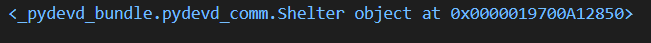

Since the `Shelter` and `Dog` models for our app have been created let's explore the important \_\_str__ method that should be added when defining classes.

This example will not be added to our app, but can be tested out in the Python shell. 

1. Start by entering the below `Shelter` class in the Python shell. 

    ```python
    class Shelter:
        def __init__(self, shelter_name, shelter_location):
            self.shelter_name = shelter_name
            self.shelter_location = shelter_location
    ```  

2. After entering the class create an instance by entering the below shelter name and their location.

    ```python
    my_shelter = Shelter('Dogs 4 U', 'Bremerton, WA')
    ```

3. Enter the below print statement to see what appears.

    ```python
    print(my_shelter)
    ```

 

When looking at the output of the `my_shelter` variable it doesn't give us any details. While it does give the class name, it only returns the id or memory address of the object. To solve this issue we need to add the \_\_str__ method to our class.

1. Now let's take the same code, but add the \_\_str__ method as below and paste it in the Python shell.

    ```python
    class Shelter:
        def __init__(self, shelter_name, shelter_location):
            self.shelter_name = shelter_name
            self.shelter_location = shelter_location

        def __str__(self):
            return f'{self.shelter_name} is located in {self.shelter_location}.'
    ```

2. Since we have now defined the \_\_str__ method let's again create an instance with the below line of code.

    ```python
    my_shelter = Shelter('Dogs 4 U', 'Bremerton, WA')
    ```

3. Now print again to the console.

    ```python
    print(my_shelter)
    ```


As you can see this now returns the shelter name and location but with some additional details. By adding these details it makes the information easier to understand then just printing out the name and location. With that said, lets now make our app models more informative by adding a \_\_str__ method. 

1. Go to the **dog_shelters/models.py** file and enter the code under the comments `# [TODO] Add __str__ method to Shelter model` and `# [TODO] Add __str__ method to Dog model`.

    ```python
    class Shelter(models.Model):
        shelter_name = models.CharField(max_length=200)
        shelter_location = models.CharField(max_length=200)
        # [TODO] Add __str__ method to Shelter model
        def __str__(self):
            return self.shelter_name
            return self.shelter_location

    class Dog(models.Model):
        shelter = models.ForeignKey(Shelter, on_delete=models.CASCADE)
        dog_name = models.CharField(max_length=200)
        dog_description = models.CharField(max_length=200)
        dog_image = models.ImageField(upload_to='images', blank=True)
        drop_off_date = models.DateTimeField(default=datetime.datetime.now())
        adoption_date = models.DateTimeField(default=datetime.datetime.now(), blank=True, null=True)
        dog_breed = models.CharField(max_length=200)

        # [TODO] Add __str__ method to Dog model
        def __str__(self):
            return self.dog_name
            return self.dog_description
            return self.drop_off_date
            return self.adoption_date
            return self.dog_breed
    ```

With this addition to our `Shelter` and `Dog` classes it will now print out the shelter name and location along with the information about the dogs.