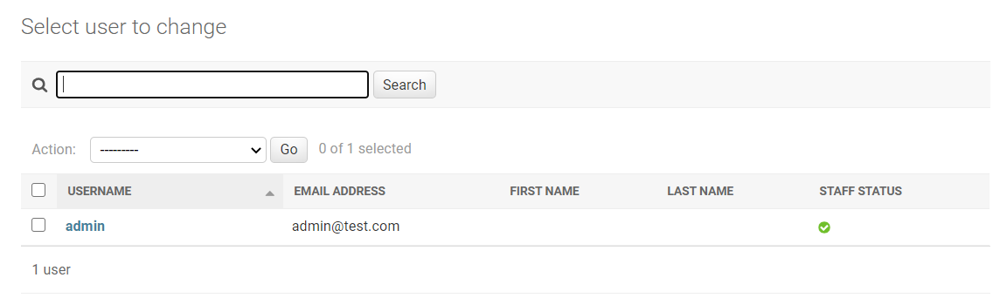

The Django platform was originally written in a newsroom environment where they needed content publishers to upload and approve content before being seen by the public eye. By creating an admin interface Django created a virtual wall that would only allow content to escape for public viewing if approved by the site administrators. This type of process is great for any application that needs to protect sensitive information or have site changes restricted for trusted users. Django has developed permissions that run based on the applications models, and while this interface is only intended for an internal tool and not an entire front end, it is still a great feature of the framework.

## Creating a superuser

When creating projects the admin interface is automatically created, but it does not configure any user access. In order to login the Django admin site we now need to create our first user. Before starting make sure to activate your virtual environment and then follow the below steps to add an admin to your application.

1. By default Django requires that an admin be a superuser to login. So to create our first superuser, navigate to the inside of the first **mydjangoproject** folder and enter the below line into the command line. 

```bash
python manage.py createsuperuser
```

2. After running this command complete the fields for the username, an email, and then a password. For this example we have chosen **admin** for the username. 

Now that these steps have been completed you will be able to login as the admin of the site.

## Logging Into The Admin Site

Now that the admin user has been created it is time for our first login to the Django admin interface. Since we have already activated the virtual environment when creating the admin user just start the server and go to your preferred browser to type the below URL.

    http://localhost:8000/admin

By entering this link it will direct you to the Django admin screen for login. 


Once you have successfully logged into the admin site you should see a screen that looks like below.


If you click on users you should now be able to see the admin user that was just added.

