## Adding models

Now that you have seen the newly created user go back to the home screen of the admin site. 


As you can see the only categories listed are **Groups** and **Users** but nothing about the app we added. Since the Django admin feature sets permissions based off of models we now have to add the **Shelter** and **Dog** models of our app to the admin site.

1. In order to add the models to the project go to the **dog_shelters/admin.py** file and enter the code under the comment `# [TODO] Register models`.

```python
# [TODO] Register models.
from .models import Shelter, Dog

admin.site.register(Shelter)
admin.site.register(Dog)
```

Once the new code is added and saved, refresh the admin screen and you should see the models are now added.


## Accessing our data

Now that we have added our models, a great feature of the admin site is the ability to change data that is associated with our models. Since we had previously added a shelter, let's click on **Shelters** to view the data.

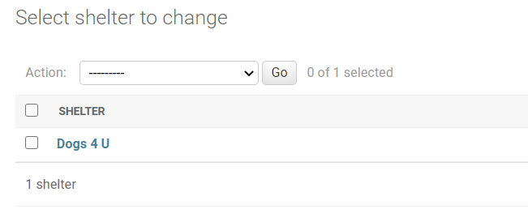

As you can see the shelter that was entered previously through the Django ORM appears in the table. Now go ahead and click on the shelter name.

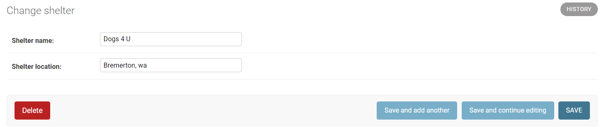

By clicking on the shelter we have accessed a feature that allows us to make changes to the information or even add another shelter. In this instance, we notice the "wa" in the location is not capitalized. We can then make the edits and save it to see the corrected location.

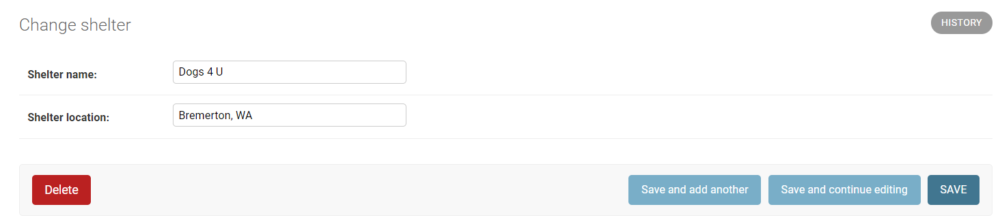

## Setting user permissions

Now that we have logged into our admin site and added the app models, let's create another user so we can add permissions.

To add the first user go to **Users** and click **Add**.

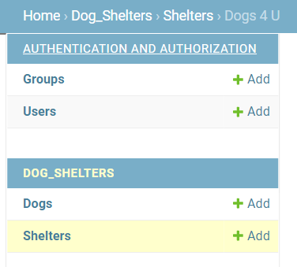

You will then be taken to the page to add another user and assign a password.


Once the information has been added click **Save** to be directed to a new page. Once reaching the new page scroll down until you reach the heading **Permissions**.

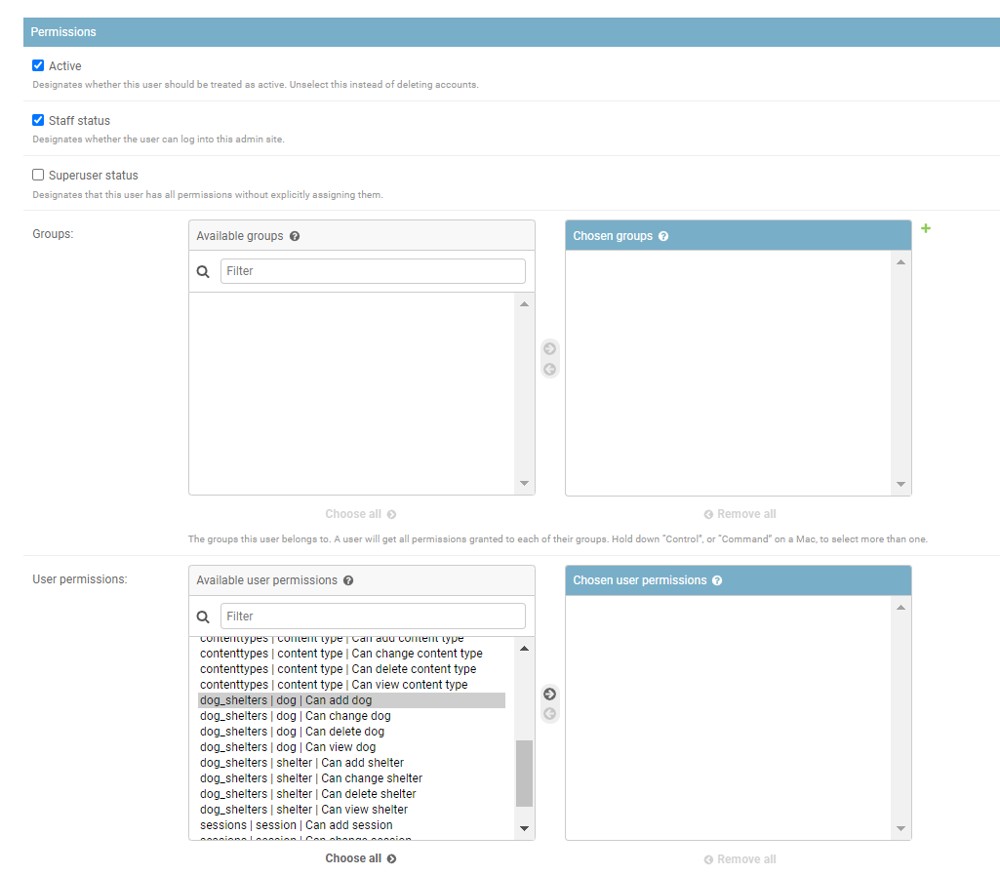

Right under the heading are checkboxes to designate the status of the user. The first checkbox named **Active** designates if the account is live. Django suggests using this checkbox to turn an account on or off instead of deleting the account. The next checkbox is **Staff Status** and this confirms if the user will be allowed to login to the admin site. The last checkbox is **Superuser status** and if checked it would give the user access to everything without having to individually assign permissions. For this user we have checked the **Active** and **Staff Status** boxes so they are able to change data through the admin site.

Next we have the actual permission settings that can be assigned individually or as a group. For this particular user the only permissions needed is the ability to add and edit the dog information.

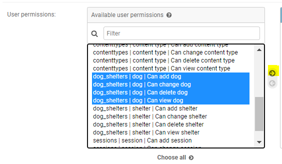

For this user we would highlight our **dog_shelters | dog** model permissions and click the arrow to add.

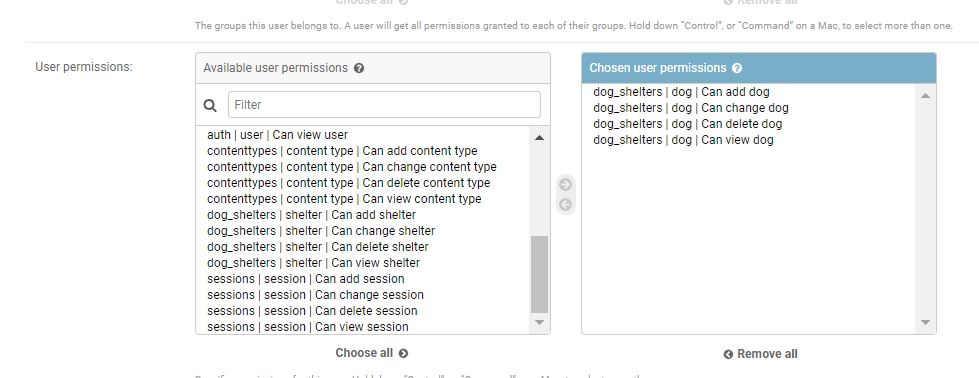

We then scroll to the bottom of the page to click **Save** and see that our new user was successfully added.


Now that we have created a new user with the ability to edit the dog information let's login as that user to see their view in the admin site.

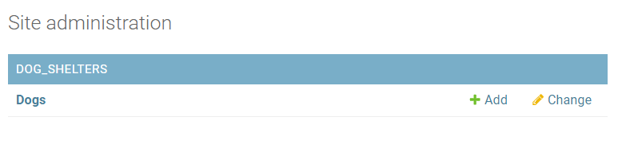

As you can see they only have access to the **Dog** model as the admin had set up for this user.

## Adding a new item

Now that we are in the new user view let's click **Add** to add a new dog to our list.


After clicking **Add** we should now see a form to add the new dog information.

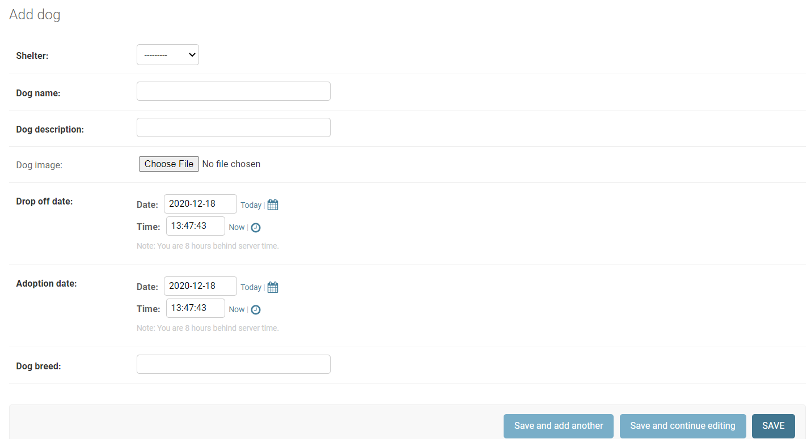

Since the admin has only entered in one shelter we are able to pick **Dogs 4 U** from the dropdown and then enter in the rest of the information. For the field **Dog Image** an image was included when you cloned the GitHub repository. Look for the folder **DatabaseImage** to upload the image.

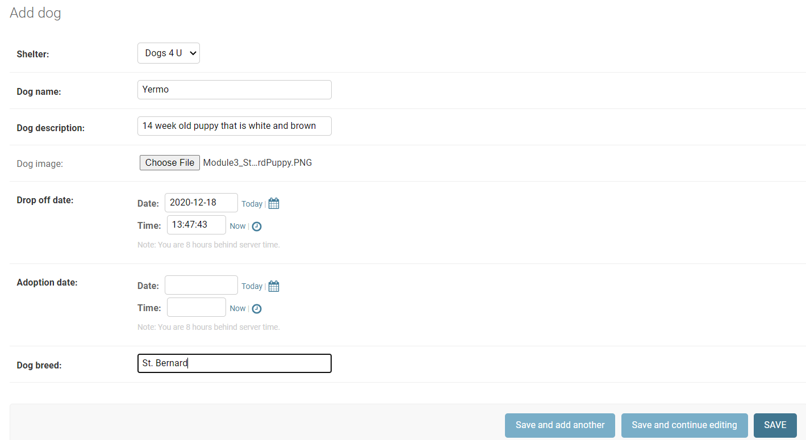

Click **Save** and we can now see that a new dog has been added to the list.

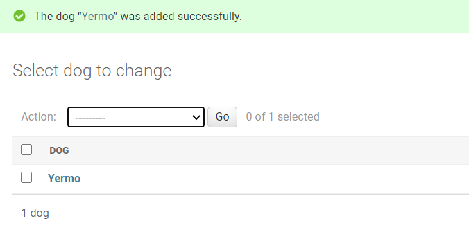

## Passwords

Passwords are an important aspect of keeping data secure, and Django has hashed the passwords in the admin interface to keep them safe. While it is not ideal sometimes the admin needs to change a user password. The admin site provides easy access to change a user password by clicking on the user and then clicking on **this form**.

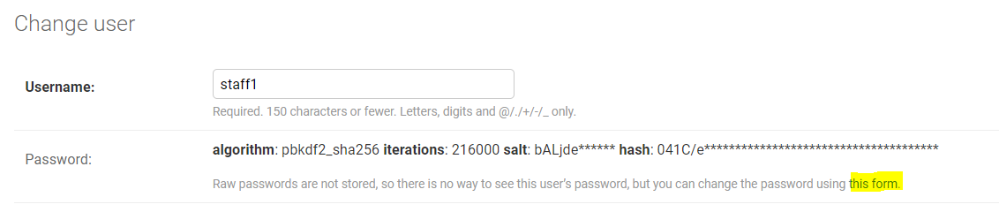

The new password could then be entered and saved for the user.


If the user has access to the admin site then the other option would be to have them change their own password. By logging into the admin site they would then be able to change the password as required.

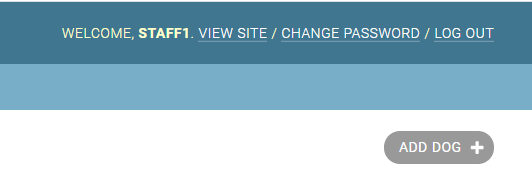

