## Adding models

Once you have finished looking at the newly created user click back to the home screen of the admin site. 

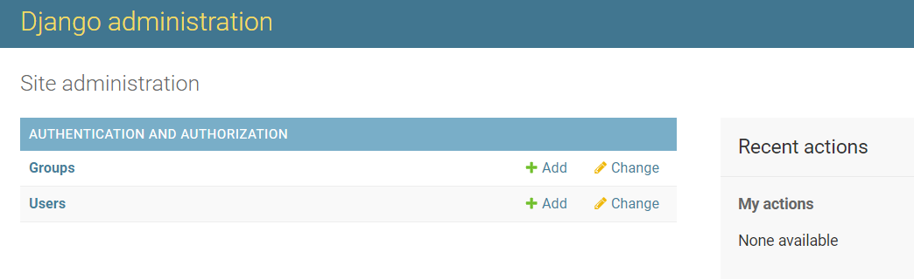

As you can see the only categories listed are **Groups** and **Users** but nothing about the app we added. Since the Django admin feature sets permissions based off of models we now have to add the **Question** and **Answer** models of our **hello_world** app to the admin site.

In order to add the models go to our project **hello_world/admin.py** file and enter the code below.

~~~
from .models import Question, Answer

admin.site.register(Question)
admin.site.register(Answer)
~~~

Once the new code is added and saved, refresh the admin screen and you should see the models are now added.

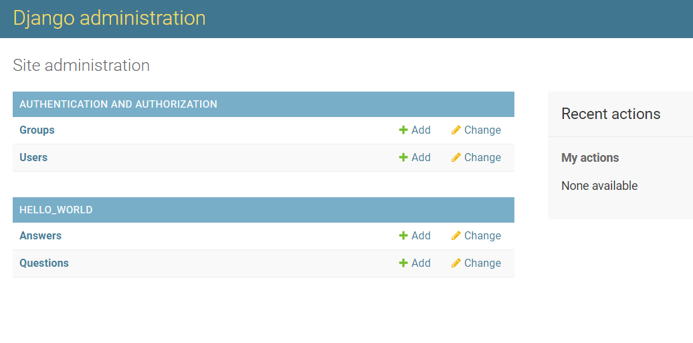

## Accessing our data

Now that we have added our models, a great feature of the admin site is the ability to change data that is associated with our models. Since we had previously added a question, let's click on **Questions** to view the data.

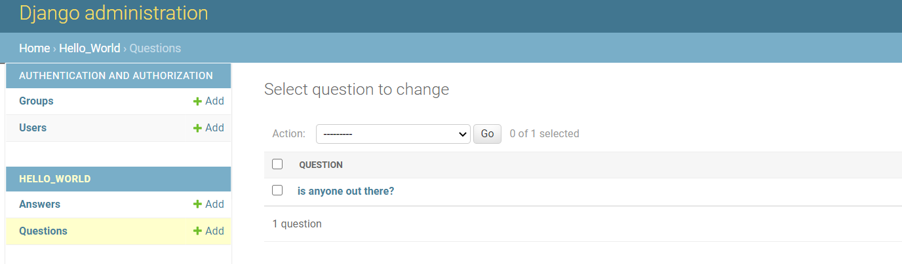

As you can see the question that was entered previously through the Django API appears in the table. Now go ahead and click on the question.

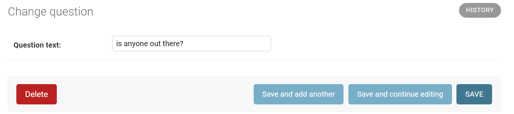

By clicking on the question we have accessed a feature that allows us to make changes to the question or even add another question. In this instance, we notice the "i" in "is" is not capitalized. We make the edits, save the question, and now see the corrected sentence.

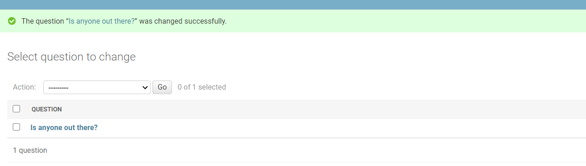

## Setting user permissions

Now that we have logged into our admin site and added the app models, let's create another user so we can add permissions.

To add the first user go to **Users** and click **Add**.

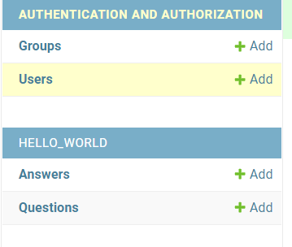

You will then be taken to the page to add another user, and assign a password.

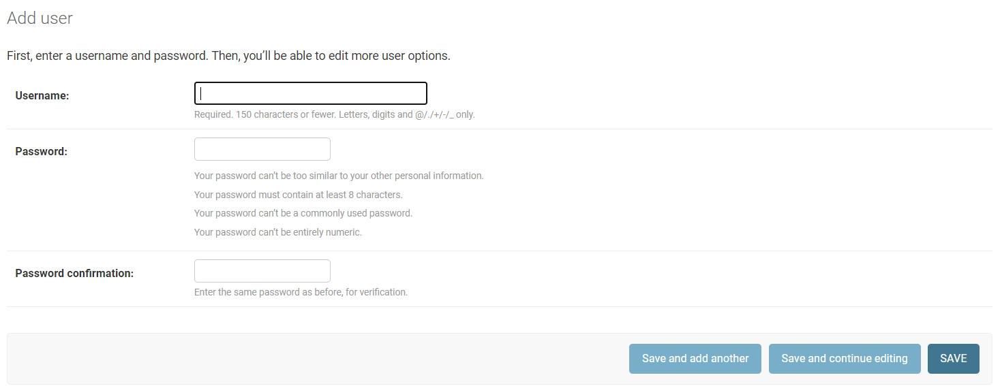

Once the information has been added click **Save** to continue entering more data about the user on another page. Once reaching the new page scroll down until you reach the heading **Permissions**.

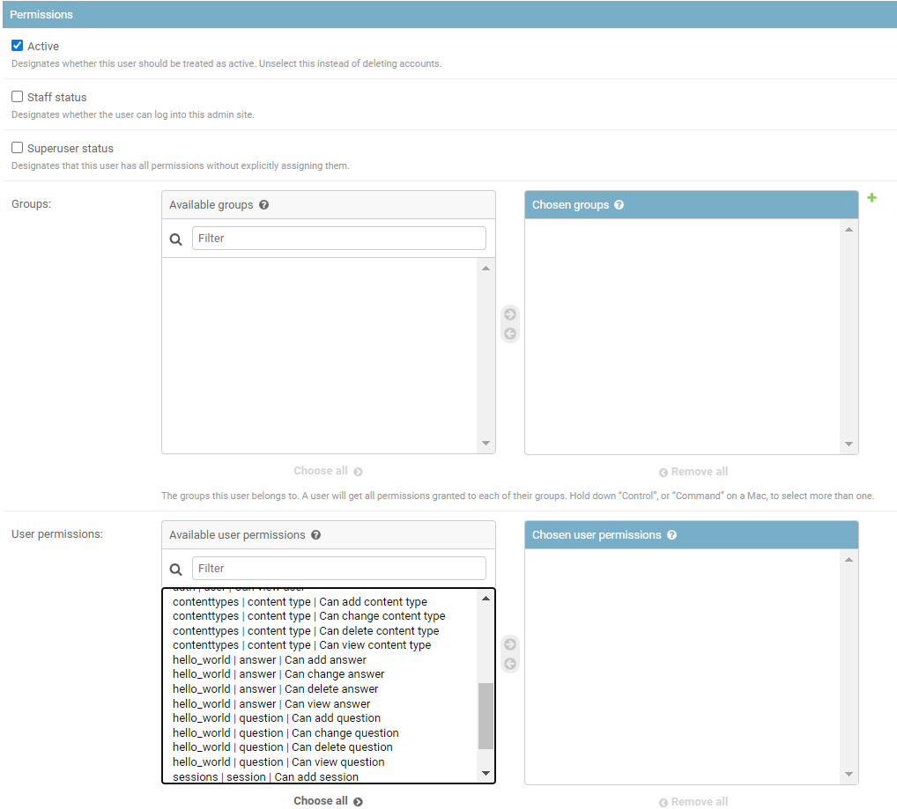

As you can see there are different ways to add user permissions, such as by a group or individual. For this particular user, the only permissions they need is to add and change questions to our app.

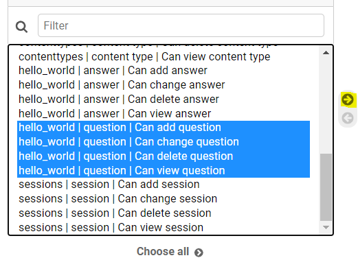

For this instance we would highlight our **hello_world** app **Question** model permissions and click the arrow to add.

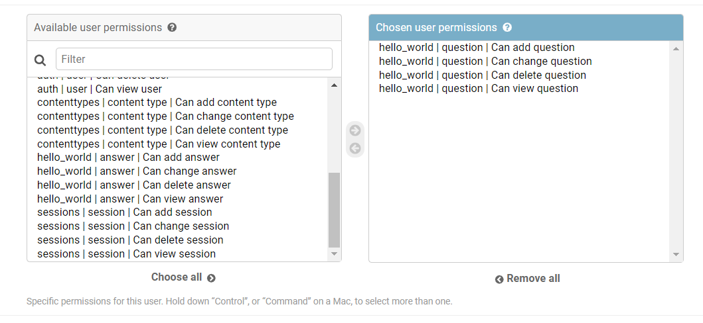

We then scroll to the bottom of the page to click **Save** and see that our new user was successfully added.

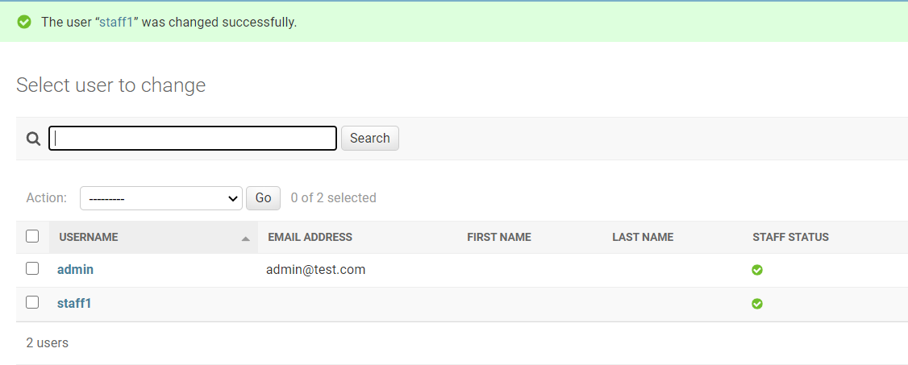