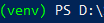

[1]: https://git-scm.com/downloads "Git website downloads"
[2]: https://docs.github.com/en/free-pro-team@latest/github/creating-cloning-and-archiving-repositories/cloning-a-repository "Clone GutHub repository"
[6]: https://docs.djangoproject.com/en/3.1/ref/django-admin/ "Command-line Utility"

For this module in the learning path we are continuing to build on an app named **dog_shelters**. Follow the below steps to install Django and retrieve the project starting files. 

## Creating a new directory

The first step in our process is to create a folder that will contain the new project. In order to create the folder go to the command prompt, navigate to the desired directory and run the below command. For this example we will be creating a new folder called **mydjangoproject**. 

```bash
# Windows
md mydjangoproject

# macOS or Linux
mkdir mydjangoproject
```
## Creating a virtual environment

Now that the new directory has been created let's create a virtual environment to hold the Django framework. Make sure you are in the newly created directory, and run the following in the command prompt.

```bash
# Windows
py -3 -m venv venv

# macOS or Linux
python3 -m venv venv
```
After executing the command there should now be a new virtual environment named **venv** contained within the directory.

## Activating a virtual environment

Now that the virtual environment has been created we have to activate it before installing Django. Using the command prompt go to the directory where the virtual environment folder is located and type the below command.

```bash
venv\Scripts\activate
```
By executing this command the virtual environment will start, and the command prompt should now look similiar to below.



The name of the virtual environment will be in parentheses followed by the path that you are in currently. This command prompt is where you will begin installing the Django framework.

## Retrieving the project starter files

### Installing Git

In order to retrieve the files contained within GitHub we need to clone the repository. To begin the cloning process Git needs to first be installed on your computer. If Git isn’t installed on your computer then go to the [Git website][1] to install the latest version. 

### Cloning the GitHub repository

Now that Git has been installed we can use it to [clone][2] our GitHub repository. To begin open a command prompt and navigate to the previously created directory **mydjangoproject**. Once in the directory start the cloning process by entering the following in the command prompt.

```bash
# [TODO] Needs final github link
git clone https://github.com/????
```
Once this has completed you should now see the **myfirstproject** project folder with the **hello_world** app within the directory.

## Django installation

Now that the starter files have been downloaded it is time to install Django. Make sure the virtual environment has been activated, and using the same command line type the below command.

```bash
pip install -r requirements.txt
```
By executing this command it will read all of the programs required for the project in the **requirements.txt** file and begin the download. Once this has completed then you can continue with the rest of the module.