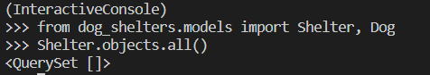
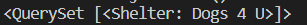

[1]: https://www.sqlite.org/download.html "Link to SQLite webpage"
[2]: https://docs.djangoproject.com/en/3.1/topics/db/queries/ "Django Queries"

If you are following the modules of this learning path in order then the below tasks have alrady been completed. If not, then follow the steps below to activate the app starter files that were cloned from GitHub, and create the SQLite database.

## Create the SQLite database

Now the app is download from GitHub there are a few things we need to do to continue setting up our project. The first step is to create the SQLite database. Navigate to the inner **mydjangoproject** folder, and look inside to see the **settings.py** file. As you look through the file you will notice Django has provided the start-up code for our database. Now to activate the database go back so you are in the main **mydjangoproject** folder and enter the following command into the command prompt.

```bash
python manage.py migrate
```

By running this command, Django searches for the **INSTALLED_APPS** setting within the **settings.py** file and creates any necessary tables according to the default settings.

## Display the schema

Now that we completed the necessary setup for our SQLite database, let's uncover the two ways to check out the schema. The first will be through the SQLite command line and the second will be in VSCode. 

[!NOTE] This task assumes SQLite is already installed, but if not then go to the SQLite website to download the [SQLite application][1].

1. The first way to check out the schema of the newly created database is to use the SQLite command line. For this task, browse through the file explorer and find the newly created database file and double click on the file.

    

    By clicking on the file it will open a new window. Once the new window is open and you are able to see the SQLite command line, enter **.schema** to display the schema of the database.

    

2. The second option to check out the contents of the database is to view it in VSCode. While there are different extensions available, we choose to install the **vscode-sqlite** extension.

    

    After installing this extension, hold down **CTRL + Shift + P** to view the command palette. Enter **SQLite: Open Database**, and then choose the appropriate database from the dropdown list. This will then open up a new view in the Explorer Pane where you can now view the database structure.

    

## Activate the model

Next we need to add our app models to the project by finding the configuration class name within the **dog_shelters** app. To find this class name go to the **dog_shelters/apps**.**py** file to find the below code and to see that the class name is **DogSheltersConfig**.

```python
class DogSheltersConfig(AppConfig):
    name = 'dog_shelters'
```

Now that you have the class name, return to the inner **mydjangoproject** folder and **settings**.**py** file to add the app config line to the list of **INSTALLED_APPS** as below.

```python
INSTALLED_APPS = [
    'dog_shelters.apps.DogSheltersConfig',
    'django.contrib.admin',
    'django.contrib.auth',
    'django.contrib.contenttypes',
    'django.contrib.sessions',
    'django.contrib.messages',
    'django.contrib.staticfiles',
]
```

By adding this line to the list of **INSTALLED_APPS** it tells Django that this app needs to be included when running the project.

Next, we need to tell Django that new models have been added and we would like for the changes to be stored as a migration. In order to do this run the below code in the command line.

```bash
python manage.py makemigrations dog_shelters
```

After running the command then you should see something similar to below stating it has stored both models as a migration.


Now in order to make our changes permenant to the database the final step is to run the migrate command in the command line.

```bash
python manage.py migrate
```

This command will apply all of our migrations and once complete you should be able to see the new additions in the schema of the database. 


[!NOTE] If you don't remember how to display the schema refer to the previous unit **Displaying The Schema**.

## Add data using Django ORM

After we created the models for our app Django automatically created an API. This API allows us to easily create, retrieve, update and delete objects in our database. To begin this interaction we first have to call a python shell by entering the below command in the command line.

```bash
    python manage.py shell
```

Once the interactive console begins we then need to import the two models that were created for the **dog_shelters** app as below.

```python
from dog_shelters.models import Shelter, Dog 
```

Before moving on to create an object, let's first test a query by asking Django to pull all shelters that have been created. 

```python
Shelter.objects.all()
```
Since we have not created any shelters a blank QuerySet should appear.



### Creating new objects

Now that we have imported our models into the python shell it is time to create an object. With the **dog_shelters** app we need to create the first shelter name and location. Add the below line to the python interactive console.

```python
s = Shelter(shelter_name='Dogs 4 U', shelter_location='Bremerton, WA')
```

After entering the question then save it to the database by entering the command below. If we were working in SQL this would be the same command as **INSERT**.

```python
s.save()
```

### Retrieving objects

Now that we have saved a shelter let's query the database to see if it was saved. When we queried the database earlier we asked for it to return all shelters, and since we had not saved any shelters it had returned a blank query. We will now perform the same query to pull all of the shelters saved to the database.

```python
Shelter.objects.all()
```
In this instance it should now print out the shelter name that was just saved.



### Modifying objects

Once objects are saved to a database there may be instances where you need to edit text or correct a misspelling. For instance, let's say after saving our first shelter we noticed the location state **'wa'** was not capitalized. 

```python
s = Shelter(shelter_name='Dogs 4 U', shelter_location='Bremerton, wa')
```

In order to change that error in the database we would use that same variable to fix the text and then save it again to the database.

```python
s = Shelter(shelter_name='Dogs 4 U', shelter_location='Bremerton, WA')
s.save()
```

In another example let's say the shelter closed, and we needed to delete it from the database. Since we had just saved a correction to this shelter we would use the same variable and delete it.

```python
s.delete()
```