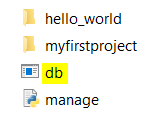
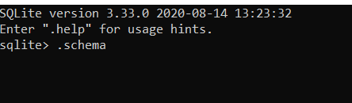
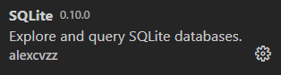
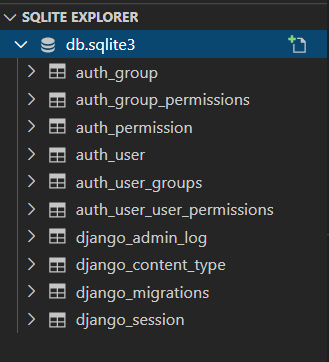

[1]: https://www.sqlite.org/download.html "Link to SQLite webpage"
[2]: https://docs.djangoproject.com/en/3.1/topics/db/queries/ "Django Queries"

If you are following the modules of this learning path in order then the below tasks have already been completed. If not, you have the option to use the SQLite database provided in the project starter files or following the below steps to create your own and don't forget to check out the database schema if you don't have SQLite installed.

## Create the SQLite database

Now that the files are downloaded from GitHub there are a few things we need to do to continue setting up our project. The first step is to create the SQLite database. Navigate to the inner **mydjangoproject** folder, and look inside to see the **settings.py** file. As you look through the file you will notice Django has provided the start-up code for our database. Now to activate the database go back so you are in the main **mydjangoproject** folder and enter the following command into the command prompt.

```bash
python manage.py migrate
```

By running this command, Django searches for the **INSTALLED_APPS** setting within the **settings.py** file and creates any necessary tables according to the default settings.

## Display the schema

Now that we completed the necessary setup for our SQLite database, let's uncover the two ways to check out the schema. The first will be through the SQLite command line and the second will be in VSCode. 

[!NOTE] This task assumes SQLite is already installed, but if not then go to the SQLite website to download the [SQLite application][1].

1. The first way to check out the schema of the newly created database is to use the SQLite command line. For this task, browse through the file explorer and find the newly created database file and double click on the file.

    

    By clicking on the file it will open a new window. Once the new window is open and you are able to see the SQLite command line, enter **.schema** to display the schema of the database.

    

2. The second option to check out the contents of the database is to view it in VSCode. While there are different extensions available, we choose to install the **vscode-sqlite** extension.

    

    After installing this extension, hold down **CTRL + Shift + P** to view the command palette. Enter **SQLite: Open Database**, and then choose the appropriate database from the dropdown list. This will then open up a new view in the Explorer Pane where you can now view the database structure.

    