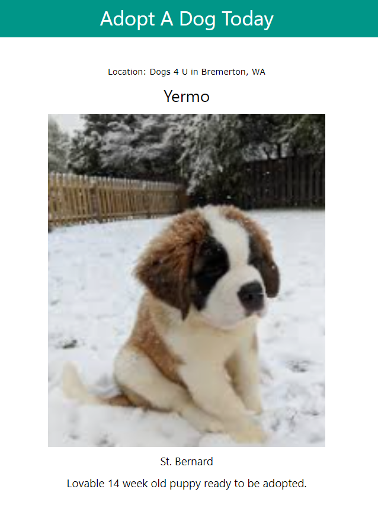
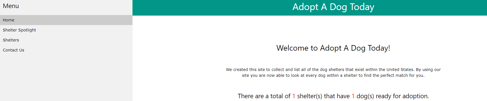
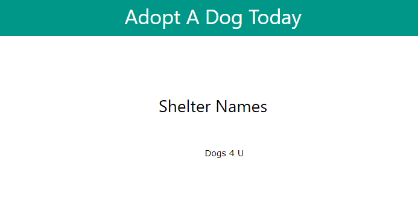
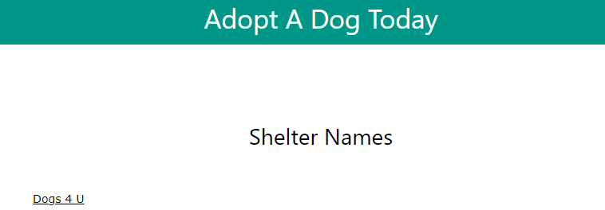
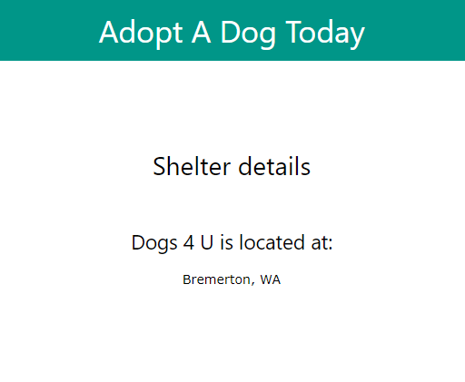

Now that the templates have been completed we need to add them to our **dog_shelters** app. By creating a view we will then be able to define the template that will be returned when a link is clicked, and allow for further processing of the data.

Since the **index.html** and **shelter_spotlight.html** need to be included in our app the first step is to add the below code under comment `# [TODO] Create your views` to the **views.py** file.

```python
# [TODO] Create your views
from dog_shelters.models import Shelter, Dog

def index(request):

    # Generate count of dog shelters in database
    shelter_count = Shelter.objects.all().count()

    # Generate count of dogs ready for adoption in database
    dog_count = Dog.objects.all().count()

    return render(request, 'index.html', {'shelter_count': shelter_count, 'dog_count': dog_count})

def spotlight(request):

    # Generate count of dog shelters in database
    get_shelters = Shelter.objects.all()

    # Generate count of dogs ready for adoption in database
    get_dogs = Dog.objects.all()

    return render(request, 'shelter_spotlight.html', {'get_shelters': get_shelters, 'get_dogs': get_dogs})
```

Now that we have completed our template views let's move on to creating the **URLconf** for our app. By adding this code we are defining what will be returned when one of the links on the site is clicked. 

1. Making sure you are still in the **dog_shelter** app create a file named **urls.py**. 

2. After the file is created add the below code.

```python
from django.urls import path
from . import views

urlpatterns = [
    path('home', views.index, name='index'),
    path('shelter_spotlight', views.spotlight, name='spotlight'),
]
```

By adding this file we have now registered the paths of the app, but in order for it to work correctly we now have to register the app paths in the project. 

1. Go to the project **adoptadog** and find the **urls.py** file to enter the below code under comments `# [TODO]: add include to the list of imports` and `# [TODO]: Add the below line to create the URLconf for the project`.

```python
# [TODO]: Add include to the list of imports
from django.urls import include, path

urlpatterns = [
    # [TODO]: Add the below line to create the URLconf for the project
    path('dog_shelters/', include('dog_shelters.urls')),
    path('admin/', admin.site.urls),
] + static(settings.MEDIA_URL, document_root=settings.MEDIA_ROOT)
```

By adding the `dog_shelters/` path we have now connected our app to the project and can view the site. If your project isn't already running then enter `python manage.py runserver` in the command line to start the app, and enter the below URL in your preferred browser.

http://localhost:8000/dog_shelters/

If everything is configured correctly you should see the home page of the site.


Clink the link in the left side navigation named **Shelter Spotlight** to see the dog that is highlighted.




Now that we have confirmed the app is up and running, and we have learned how to format template views let's start adding more content.

## Generic Views

Because Django was created on the premise that development processes were too repetitive and time to deployment was too long it's only understandable that they would try and shorten views. While these views might not be ideal for complex tasks, Django has provided a small amount of built-in **Generic** views that are great for simple processes like generating lists or providing detailed views.

### Creating a list view

The first generic view that we will add to our app is the **ListView**, and this will let us display the list of dog shelters that are currently in the database. Let's begin by creating a template named **shelter_list.html** in the app template folder. After creating this template enter the below code.

```html



    <h2 style="text-align: center; margin-top: 100px;">Shelter Names</h2>
    <div style="width: 850px; margin: auto; text-align: center; margin-top: 50px;">
        <ul>
            
                {{ get_shelters.shelter_name }}
            
        </ul>
    </div>

```

As you can see we have again extended the **index.html** file to continue with the same page layout, and added a loop to list all of the shelter names contained within the database.

After completing the template code our next step is to add the view. 

1. Go to the **views.py** file in the app and add the below code under the comment `# [TODO] Add Generic Listview`.

```python
# [TODO] Add Generic Listview
from django.views.generic import ListView

class ShelterList(ListView):
    model = Shelter
    context_object_name = 'my_shelter_list'
    template_name = "shelter_list.html"
```

We first start by importing `ListView`, and then add a `ShelterList` class that will contain the details. The first step in defining the `Listview` is to name the model. In this case we are using the `Shelter` model that was already defined in the **models.py** app file. The next thing we added was a `context_object_name`. If this variable was not added the only way to call this view would be to use `object_list` in our template loop as seen below.

```html
<ul>
    
        {{ get_shelters.shelter_name }}
    
</ul>
```

By calling the view this way it does not give much information about what is being requested. Since this is a small app it may not seem that important, but it is a good idea to get in the habit of providing as much detail as possible. So in this case we have changed the listview name to `my_shelter_list`, and the last thing we provided was the `template_name` for this view called `shelter_list.html`.

Now that the view code is added we need to connect everything together by first adding the path to our new template. 

1. Make sure you are still in the app folder and go to the **urls.py** file to add the below path under comment `# [TODO]: Add the path for ShelterList ListView`. 

```python
urlpatterns = [
    path('home', views.index, name='index'),
    # [TODO]: Add the path for ShelterList ListView
    path('shelter_list', views.ShelterList.as_view(), name='ShelterList'),
    path('shelter_spotlight', views.spotlight, name='spotlight'),
]
```

2. Then go to the **index.html** file to add the URL under the comment `<!-- TODO - Create the URL for the new template page shelter_list -->` to complete the process.

```html

  {{ block.super }}
  <a href="shelter_spotlight" class="w3-bar-item w3-button">Shelter Spotlight</a>
  <!-- TODO - Create the URL within the sidebar block for the new template page shelter_list -->
  <a href="shelter_list" class="w3-bar-item w3-button">Shelters</a>

```

Now that we have created our first **ListView** let's see what it looks like in our app. If your app is not running then start it by typing `python manage.py runserver` in the command line and typing the web link in your preferred browser. If everything is working correctly you should see the new link **Shelters** in the home page.



Click on the link see the newly created template with the listview of shelters.




### Creating a detail view

Now that the list view has been created let's create a generic **DetailView**. For this example we will be working with the information contained on the **Shelters** page and creating a detailed view when clicking on a specific shelter. We need to again create another template.

1. In the app templates folder create a file named **shelter_details.html**. After creating the file enter the below code.

```html



    <h2 style="text-align: center; margin-top: 100px;">Shelter details</h2>
    <div style="width: 850px; margin: auto; text-align: center; margin-top: 50px;">
        <h3>{{ shelter.shelter_name }} is located at:</h3>
        <p>{{ shelter.shelter_location }}</p>
    </div>

```

We have again extended the **index.html** file to keep the same layout, and added the variables needed to call the shelter information. 

2. The next action is to go to the **views.py** file and add the below code under the comment `# [TODO] Add Generic Detailview`.

```python
# [TODO] Add Generic Detailview
from django.views.generic import DetailView
from django.shortcuts import get_object_or_404

class ShelterDetail(DetailView):
   def get(self, request, *args, **kwargs):
        shelter = get_object_or_404(Shelter, pk=kwargs['pk'])
        context = {'shelter': shelter}
        return render(request, 'shelter_details.html', context)
```

As you can see we have imported `DetailView`, and then `get_object_or_404`. We use the `get_object_or_404` statement in the `shelter` variable so it will check if the object being requested actually exists. If the object did not exist then an exception would be thrown. We next go to `context` and define the variable that will be used by the template to call this view, and lastly state what will be rendered in the template.

Now that the view has been added we need to add the path. 

3. Go to the **urls.py** file in the app and add the below under comment `# [TODO]: Add the path below for our ShelterDetail DetailView`.

```python
urlpatterns = [
    path('home', views.index, name='index'),
    # [TODO]: Add the path below for our ShelterList ListView
    path('shelter_list', views.ShelterList.as_view(), name='ShelterList'),
    # [TODO]: Add the path below for our ShelterDetail DetailView
    path('<int:pk>', views.ShelterDetail.as_view(), name='ShelterDetail'),
    path('shelter_spotlight', views.spotlight, name='spotlight'),
]
```

As you can see we have added `<int:pk>` at the beginning of this path. This was added since we want the detail view to be called when the user clicks on the shelter id. In order for this path to work correctly we now need to modify the code a little in the **shelter_list.html** page.

4. Go to the **shelter_list.html** template and add the code under comment `<!-- TODO - Add URL for shelter id to request correct path for DetailView  -->` to create the URL.

```html

    <h2 style="text-align: center; margin-top: 100px;">Shelter Names</h2>
    <div style="width: 850px; margin: auto; text-align: center; margin-top: 50px;">
        <ul>
            
                <!-- TODO - Add URL for shelter id to request correct path for DetailView  -->
                <a href="{{ get_shelters.get_absolute_url}}{{ get_shelters.id }}" >{{ get_shelters.shelter_name }}</a>
            
        </ul>
    </div>

```

With the addition of this line we have created a URL that shows the shelter name but is requesting the database information by the shelter `id`. By making this change it will allow the detail view to be called when a user clicks on the shelter name.

Now that we have created the **DetailView** let's see how it has changed the app. Again If your app is not running start it by typing `python manage.py runserver` in the command line and typing the web link in your preferred browser. Click on the **Shelters** link to see the list of shelters that are currently in the database. When looking at the list you should see the shelter name that is now clickable.



Click on the shelter name, and you should see the newly created template with the **DetailView** of the shelter.


