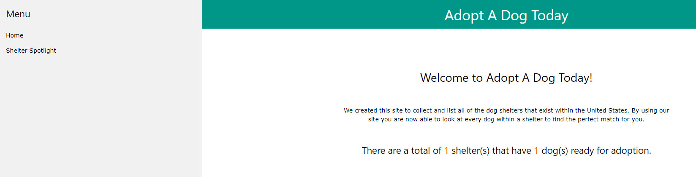

[1]: https://git-scm.com/downloads "Git website downloads"
[2]: https://docs.github.com/en/free-pro-team@latest/github/creating-cloning-and-archiving-repositories/cloning-a-repository "Clone GutHub repository"
[3]: https://www.sqlite.org/download.html "Link to SQLite webpage"
[4]: https://www.python.org/  "Install Python"

For this module in the learning path we are continuing to build on an app named **dog_shelters**. Follow the below steps to install Django and retrieve the project starting files.

## Creating a new directory

The first step in our process is to create a folder that will contain the new project and also the virtual environment that will hold the Django framework. In order to create the folder go to the command prompt, navigate to the desired directory and run the below command. For this example we will be creating a new folder called **dogsforadoptionproject**.

```bash
# Windows
md dogsforadoptionproject

# macOS or Linux
mkdir dogsforadoptionproject
```

## Creating a virtual environment

Now that the new directory has been created let's create a virtual environment to hold the Django framework. Make sure you are in the newly created directory, and run the following in the command prompt.

```bash
# Windows
py -3 -m venv venv

# macOS or Linux
python3 -m venv venv
```

After executing the command there should now be a new virtual environment named **venv** contained within the directory.

## Activating a virtual environment

Now that the virtual environment has been created we have to activate it before installing Django. Using the command prompt go to the directory where the virtual environment folder is located and type the below command.

```bash
# Windows
venv\\Scripts\\activate

# macOS or Linux
source ./venv/bin/activate
```

By executing this command the virtual environment will start, and the command prompt should now look similar to below.


The name of the virtual environment will be in parentheses followed by the path that you are in currently. This command prompt is where you will begin installing the Django framework.

## Installing Git

In order to retrieve the files contained within GitHub we need to clone the repository. To begin the cloning process Git needs to first be installed on your computer. If Git isn’t installed on your computer then go to the [Git website][1] to install the latest version. 

## Cloning the GitHub repository

Now that Git has been installed we can use it to [clone][2] our GitHub repository. To begin open a command prompt and navigate to the previously created directory **dogsforadoptionproject**. Once in the directory start the cloning process by entering the following in the command prompt.

```bash
# [TODO] Needs final github link
git clone https://github.com/????
```

Once this has completed you should now see the **adoptadog** project folder with the **dog_shelters** app within the directory.

## Installation overview

Before installing Django we first need to make sure the correct Python version is installed for the framework. In order to check your installed version navigate to your command prompt and type the following.

```bash
# Windows
python --version 

# macOS or Linux
python --version 
```

By executing this command it will display what Python version is installed on your computer. For this module we are using the latest official version of Django and they recommend using Python 3 in order to have access to the latest Python features. If you do not have Python installed then proceed to the [Python website][4] to download the correct version.

## Django installation

Now that the starter files have been downloaded it is time to install Django. Make sure the virtual environment has been activated, and using the same command line type the below command.

```bash
pip install -r requirements.txt
```

By executing this command it will read all of the programs required for the project in the **requirements.txt** file and begin the download.

## Install SQLite

For this project we will be using the SQlite database. If you already have SQLite installed then continue with the rest of the steps. If not then go to the SQLite website to download the [SQLite application][3].

## Deploying the Django app

Now that the virtual environment has been created, the Django framework is downloaded, and the starter files have been cloned let's run the app to make sure it is working correctly. If you have not connected the server then navigate to the **adoptadog** root directory and enter the below code.

```bash      
python manage.py runserver
```

After starting the server enter the below link into your preferred browser.

    http://localhost:8000/adoptadog/

If the app is functioning properly then you should see the app home page similar to below.

