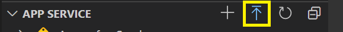
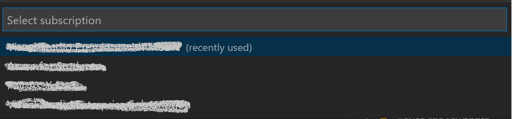
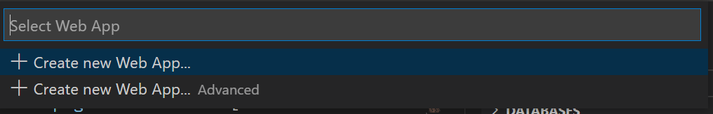
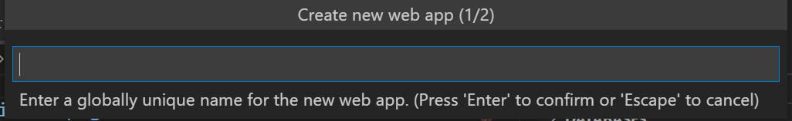
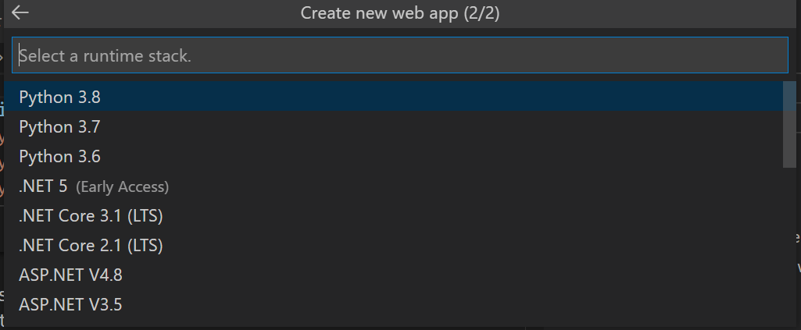
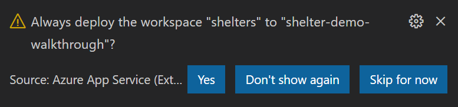
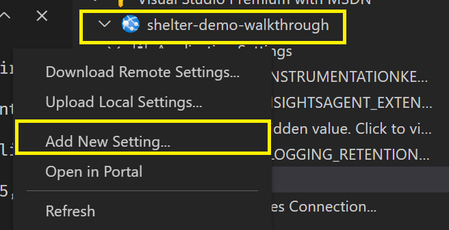
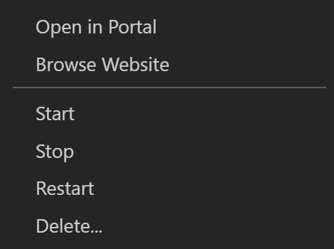

To make our site available to the public, we are going to deploy it to Azure. We will use the Azure App Service extension in Visual Studio Code to streamline the process.

## Install the Azure App Service extension

We will start by installing the extension into Visual Studio Code.

1. Inside **Visual Studio Code**, click the **Extensions** icon

    

1. In the **Search Extensions** dialog, type **App Services**
1. Under **Azure App Service**, click **Install**
1. The extension will install

## Deploy the application

With our extension installed, let's perform the installation

1. Inside **Visual Studio Code**, click the **Azure** icon on the toolbar

    

1. Click **Sign in** to sign into your Azure accout

    > ![NOTE]
    > If you do not have an Azure account, you can [sign up for a free account](https://azure.microsoft.com/en-us/free/)

1. On the **App Service** bar, click the **Deploy** icon

    

1. On **Select subscription**, choose your Azure subscription

    

1. Select **Create new Web App**

    

1. Provide a unique name for your application

    

1. Select **Python 3.8** as the runtime stack

    

    The extension will now create your web application and begin deploying your application. This will take a few moments.

1. Select **Yes** prompted to **Always deploy the workspace** to the application you created during the deployment

    

Your site will now deploy!

## Configuring Application Settings

Application Settings are local environmental variables for Azure App Services. They can be read in any application hosted on Azure App Services in the same fashion you read any other environmental variable.

When running on development, we configured our application to use **.env** for these settings. For production, we will use **Application Settings**.

1. After the site deploys, inside the **App Service** extension, expand your subscription
1. Expand your application
1. To create the first Application Setting, right click on **Application Settings** and click **Add New Setting**

    

1. In the first dialog, provide the name **DEBUG** and press enter
1. In the second dialog, provide the value **False** and press enter
1. Perform the same steps to create a new setting with the name **SECRET_KEY** and a random string of characters for the value

By creating these settings, we have now configured the `DEBUG` setting to be false, and a secure key for our `SECRET_KEY` on production.

## Browse to your site

With everything deployed and configured, we can now view our website on Azure!

1. Right click on the name of your site inside the **App Service** extension and click **Browse Website**

    

1. Your website now appears

Because we deployed our SQLite database, you should notice your site already contains data. If you navigate to location which doesn't exist on your site you will notice you receive a generic **Not found** error because `DEBUG` is disabled.

You have now deployed a website to Azure!
