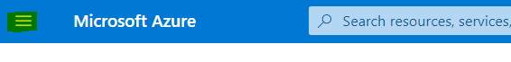
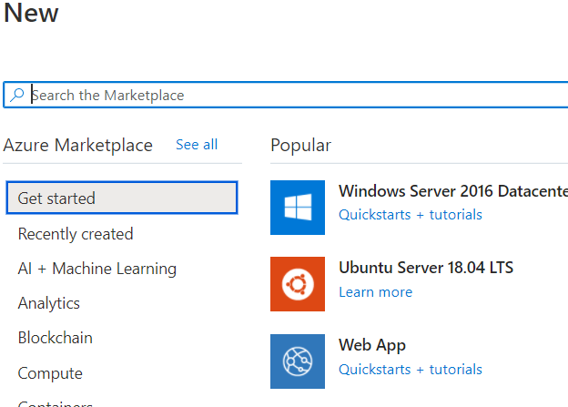
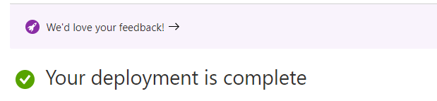
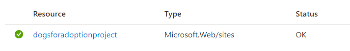
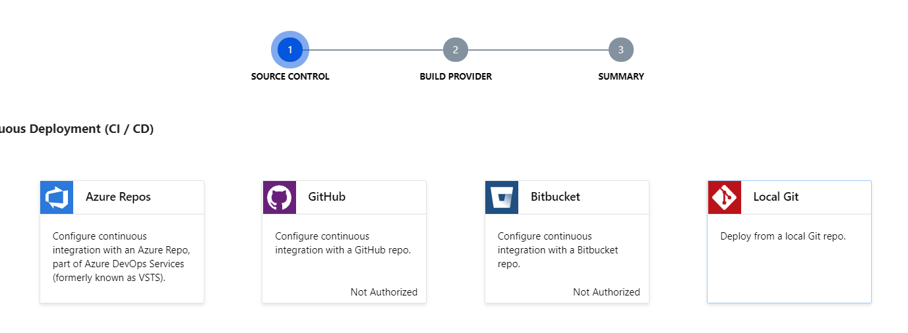
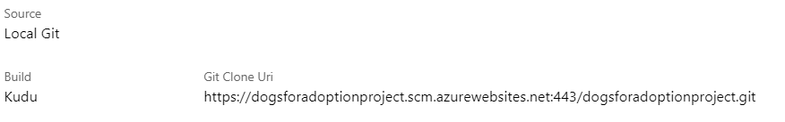

[1]: https://azure.microsoft.com/en-us/free/ "Free Azure Account"

To begin the process of uploading our project we first need an Azure account. If you do not have an account then go to [Azure][1] to set up a free account.

## Azure configuration

Once in the Azure portal the first thing to do is create a resource. 

1. Click on the collapsed menu icon to reveal the dropdown options.




2. Once you are able to see the dropdown select **Create Resource**.


After selecting **Create Resource** you should now be able to see the option to create a **Web App**. If you don't see the **Web App** option then go to the search bar to find it.



3. After clicking **Web App** fill out the needed information.  

    * Name: **dogsforadoptionproject**
    
        [!NOTE] if this name exists then feel free to pick any name for the project.

    * Operating System: Linux
    
    * Runtime Stack: Python 3.7

Once the form is completed and submitted, you should see Azure processing the request and a notification will appear when the deployment is complete.



Now that the Azure deployment is complete you will see the new project in the Resource list. 



Click on the project name and another screen will appear with a list of options on the left hand side that are available for your web app. Look for the heading **Deployment** and choose the option **Deployment Center**. 


When the **Deployment Center** page appears you will have two steps to complete.



1. Define the source control
    
    For this first step look for the option **Local Git**. Once selected then click "Continue" at the bottom of the page.


2. Select the build provider

    For this example pick **App Service build service** and then "Continue" at the bottom of the page.

On the next page it will give a summary of the chosen options and the only thing left to do is click "Finish" at the bottom of the page. Azure will then deploy the app and automatically create a **Git Clone Uri** that will be used to connect to your local repository.



Now that we have completed the Azure setup you should be able to paste the below link in your browser and access the default Azure page.

[!NOTE] **dogsforadoptionproject** was the name we picked when filling out the Azure project information at the beginning. If you had to pick a different name then that would be substituted here.

```
dogsforadoptionproject.azurewebsites.net
```

While we are able to access the app page it only shows the Azure default page as we still need to upload the Django project code. 
